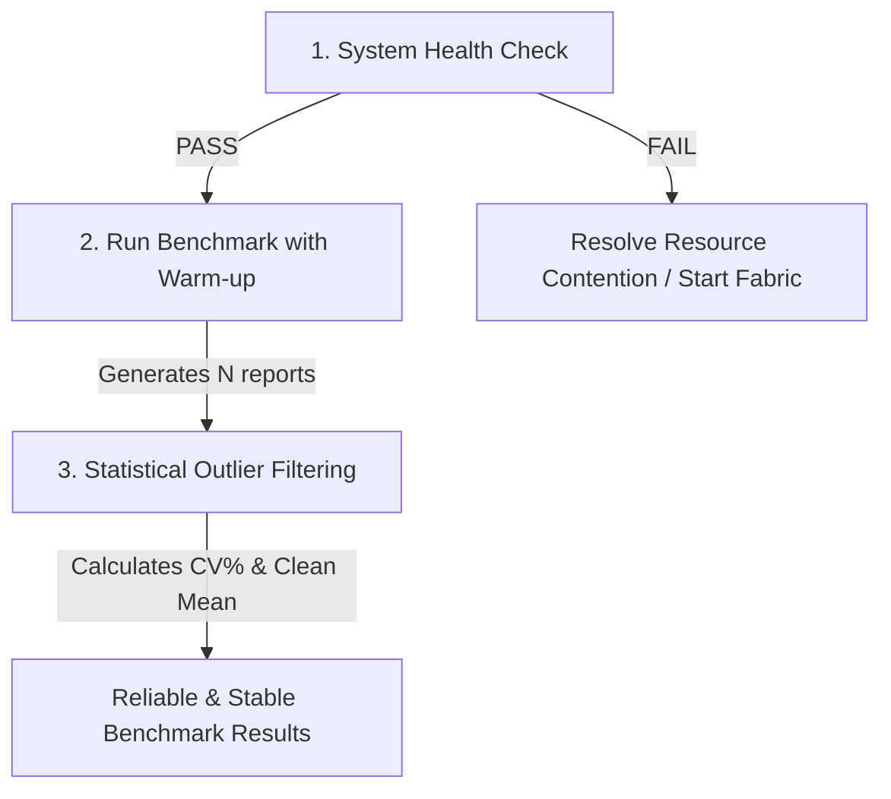

# Caliper Benchmark Stability & Variance Reduction Toolkit

This directory contains a suite of tools designed to diagnose, mitigate, and filter environmental noise and JIT/GC-related variance in Hyperledger Caliper benchmarks. 

By default, short benchmark runs (e.g., `txDuration=30s`) on shared or desktop environments suffer from high result variance (Coefficient of Variation $\approx 8.5\%$) due to transient resource spikes and JIT warm-up cycles. This toolkit stabilizes runs, filters outliers, and establishes a robust methodology for generating reproducible performance metrics.

---

## 1. The Variance Problem & Root Causes

During performance testing, identical runs of the same configuration (`bcms-s1-sha256-tps200`, `workers=4`) can produce significantly different results (e.g., Average Latency varying between `0.46s` and `3.11s`). The primary contributors to this noise include:

* **JIT Warm-up Overhead:** The Node.js virtual machine (Caliper Manager/Workers) and the Go runtime (Fabric chaincode containers) require time to compile hot code paths into optimized machine code. The first few seconds of any benchmark run suffer from unoptimized execution path overhead.
* **Garbage Collection (GC) Spikes:** Short run durations are disproportionately impacted by GC cycles. If a major GC pause occurs during a 30-second run, average latency rises dramatically.
* **Disk I/O Latency:** Under peer databases (e.g., CouchDB state commit) and Raft ledger block writing, disk I/O wait spikes can temporarily choke throughput.
* **Insufficient Duration:** A 30-second duration is too short for rate-ramping rounds (such as `VerifyCertificate` 40 $\rightarrow$ 200 TPS) to stabilize at higher throughput increments.

---

## 2. The Stability Workflow

To achieve highly reproducible and reliable results, you should follow this structured three-step workflow before publishing or comparing any benchmark results:



### Step 1: Pre-Run System Check (`check_env.sh`)
Verifies system resource availability and checks that all required Fabric network containers are up and running.

### Step 2: Warm-up & Cooldown Run (`run_benchmark.sh`)
Prepend a 15-second low-rate warm-up round to force the JIT compiler to warm up, sleep 10 seconds to allow the system to cool down, and run the real benchmark $N$ times.

### Step 3: Statistical Filtering (`analyze_runs.py`)
Parses all generated HTML reports, computes the mean, standard deviation, and Coefficient of Variation (CV%), flags outliers using the **1.5 IQR rule**, and calculates a clean mean.

---

## 3. Script Documentation & Usage

All scripts are configured to run inside your Linux/WSL environment.

### 📊 Script 1: Pre-Run System Check (`check_env.sh`)
This script evaluates host performance metrics and confirms container health before starting the benchmark.

* **Checks Performed:**
  * CPU Load Average (Warns if 1-minute load average > `0.5`)
  * Available RAM (Warns if free memory < `2.0 GB`)
  * Disk I/O Wait (Warns if CPU I/O wait > `5%` over a 0.5s sample)
  * Fabric Network Health (Critical: checks if `peer0.org1.example.com`, `peer0.org2.example.com`, and `orderer.example.com` are running)
* **Exit Codes:** Exits with `0` (Success) if all critical checks pass, and `1` (Failure) if any critical check fails.
* **Usage:**
  ```bash
  ./check_env.sh
  ```

### 🌡️ Script 2: Warm-up wrapper script (`run_benchmark.sh`)
Automates the warm-up protocol and executes the benchmark multiple times to build a statistically significant sample set.

* **Features:**
  * Auto-generates a temporary 15-second warm-up config (`temp_warmup_config.yaml`) using the first round's workload at a fixed rate of `10 TPS`.
  * Runs the warm-up round to trigger runtime optimization (JIT compiling).
  * Pauses for `10 seconds` to clear queues, flush transactions, and settle the CPU.
  * Runs the actual benchmark and copies `report.html` to `./reports/` with a timestamp.
  * Repeats $N$ times (default is 5).
  * Prints a formatted summary table of all runs on completion.
* **Usage:**
  ```bash
  ./run_benchmark.sh <caliper-config-path> [N_runs]
  ```
* **Example:**
  ```bash
  ./run_benchmark.sh caliper-workspace/benchmarks/benchConfig_s1_sha256_tps200.yaml 5
  ```

### 📈 Script 3: Statistical Outlier Filter (`analyze_runs.py`)
Reads Caliper HTML reports and performs IQR-based statistical analysis to remove performance anomalies.

* **Metrics Analyzed:**
  * Throughput (TPS), Avg Latency (s), Max Latency (s) for both `IssueCertificate` and `VerifyCertificate` rounds.
* **Outlier Filtering (1.5 IQR Rule):**
  * Computes the Interquartile Range ($IQR = Q3 - Q1$) for all 6 metrics.
  * Defines valid range bounds as $[Q1 - 1.5 \times IQR, Q3 + 1.5 \times IQR]$.
  * Flags any run that has a metric outside this boundary as an outlier.
  * Calculates a **Clean Mean** and **Clean CV%** excluding the flagged outlier runs entirely.
  * Saves results to `summary.csv` for archival/plotting.
* **Usage:**
  ```bash
  python analyze_runs.py --dir ./reports --pattern '*_report.html'
  ```

---

## 4. Understanding & Interpreting Stability Metrics

### Coefficient of Variation (CV%)
The Coefficient of Variation measures relative variability and is calculated as:
$$\text{CV}\% = \left( \frac{\text{Standard Deviation}}{\text{Mean}} \right) \times 100$$

Use the following reference scale to evaluate the stability of your runs:

| CV% Range | Status | Action Required |
| :--- | :--- | :--- |
| **< 5%** | **Acceptable (Stable)** | No action needed. The benchmark environment is quiet and JIT/GC noise is minimized. |
| **5% - 10%** | **Concerning** | Inspect background processes. If an outlier was flagged and the Clean CV% drops below 5%, the results are usable after filtering. |
| **> 10%** | **Unacceptable (Noisy)** | Reject the entire batch of runs. Check host load, verify disk I/O, increase RAM limits, and re-run after stabilization. |

### What to Do When Outliers Are Detected?

> [!NOTE]
> Outliers are caused by random external events (e.g. system updates, VM hypervisor context switching, major GC pause). 

1. **Verify Clean CV%:** Check the `Clean CV%` row in the analysis output. If it is `< 5%`, the outlier was successfully isolated and the remaining runs are statistically stable.
2. **Investigate the Outliers:** Look at the "Flagged Outlier Runs" section at the bottom of the script output. If the deviation is huge (e.g. latency $10\times$ higher), it was likely a temporary disk stall or a GC block.
3. **Re-run if Necessary:** If more than 2 runs in a 5-run batch are flagged as outliers, or if the `Clean CV%` remains above 10%, terminate all background apps and re-run `./run_benchmark.sh` after running `./check_env.sh` to ensure a green status.

---

## 5. Stable Benchmark Configurations

A stable configuration has been saved at:
[bcms-s1-sha256-tps200-stable.yaml](file:///c:/Users/USERW/pro1/fabricNew/caliper-workspace/benchmarks/bcms-s1-sha256-tps200-stable.yaml)

### Changes Made vs Baseline:
1. **`IssueCertificate` duration increased from 30s to 60s:** Stabilizes Node.js workers and settles CouchDB commit operations over a longer steady-state.
2. **`VerifyCertificate` duration increased from 30s to 120s:** Because VerifyCertificate ramps up throughput linearly ($40 \rightarrow 200\text{ TPS}$), a 120s window allows the target rate to climb slowly, minimizing transient queues and allowing peer resource consumption to stabilize.
3. **Workers set to 4:** Maximizes host core utilization without saturating the docker bridge network.
